# Project

## Diagram

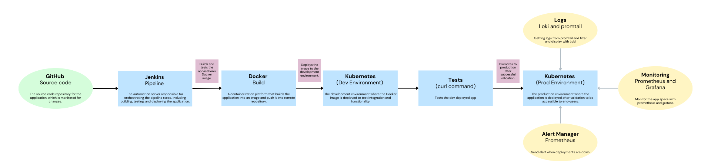

## Requirements

- Docker
- Docker Compose
- Minikube
- Kubectl
- Git
  
### Check Requirements

```bash
docker --version            # Should be Docker 24.0.7 or higher
minikube version            # Should be Minikube v1.31.2 or higher
kubectl version --client    # Should be Kubernetes CLI v1.28.3 or higher
docker-compose --version    # Should be Docker Compose v2.23.0 or higher
git --version               # Should be Git 2.41.0 or higher
```

## Setup

<!-- 
Install go libraries

```bash
sudo apt install golang-go
go get -u github.com/cncf/buildpack/pack
``` -->

### Retrieve the source code repository locally on your virtual machine with the command

```bash
git clone https://github.com/AlexiFa/DevOps-M2.git
cd DevOps-M2/Project
```

### Set docker to be used without sudo

```bash
sudo usermod -aG docker $USER && newgrp docker
```

### Launch Jenkins

```bash
sudo docker run -d -p 8081:8080 -p 50000:50000 --name jenkins -v /var/run/docker.sock:/var/run/docker.sock --restart unless-stopped jenkins/jenkins:lts-jdk17
```

Get the admin password

```bash
sudo docker exec jenkins cat /var/jenkins_home/secrets/initialAdminPassword
```

- select `install the suggested plugins` (wait for the installation to finish and do the setup steps)

### Create Credentials <!-- TOcheck -->

Navigate to Manage Jenkins > Credentials in the Jenkins interface.

Add two sets of credentials by clicking on (Global) then Add Credentials:

```text
Docker Hub:

- Username: efrei2023

- Password: efrei2023

- ID: dockerhub-credentials
```

### Set Up a Jenkins Slave

#### Prepare the Slave Machine

- Install Java (Jenkins requires Java to run). (openjdk 17)

- Install Docker (if builds involve Docker commands).
  
#### Connect the Slave to the Master

On Jenkins, go to Manage Jenkins > Nodes > New Node.

#### Add the slave machine details

- Name it "jenkins-slave".

- Choose "Permanent Agent".

- Set up the remote root directory (take a dir where you have right eg: /home/alex/workspace/agent).
  - you need to create the directory

#### Start the Slave

click on the slave and copy the command line to run on your machine

eg.:

```bash
curl -sO http://localhost:8081/jnlpJars/agent.jar
sudo java -jar agent.jar -url http://127.0.0.1:8081/computer/ -secret <SECRET_KEY privided> -name "jenkins-slave" -webSocket -workDir "/home/alex/worksapce/agent"
```

#### Verify Connection

The slave should now appear as "online" in the Jenkins "Nodes" section.

### Create Jenkins Pipeline <!-- TODO : add arrows to the screenshots -->


then, you can build the pipeline from the jenkins dashboard and at the end you will see the container running

`note`: you may need to enter the sudo password in the command line where the agent.jar is running

```bash
sudo docker ps
```

And you will see the API running at `http://localhost:8080`

`http://localhost:8080/whoami` will return our names

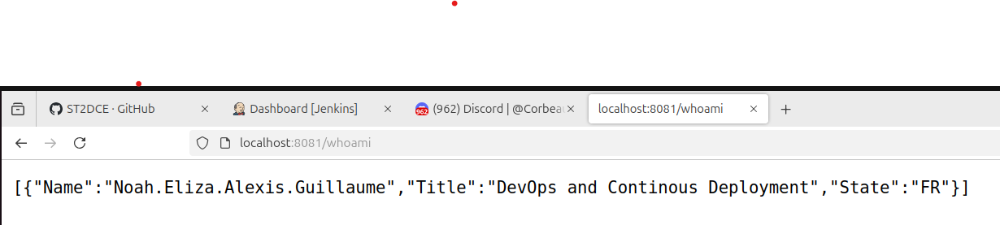

## Kubernetes deployemnt

### Start minikube

Start minikube with the following command

```bash
minikube start --driver=docker --memory=6000 --cpus=4 # because of the requirements of the project (loki)
```

### create a new item pipeline on Jenkins

This time, select the Jenkins-minikube.build file

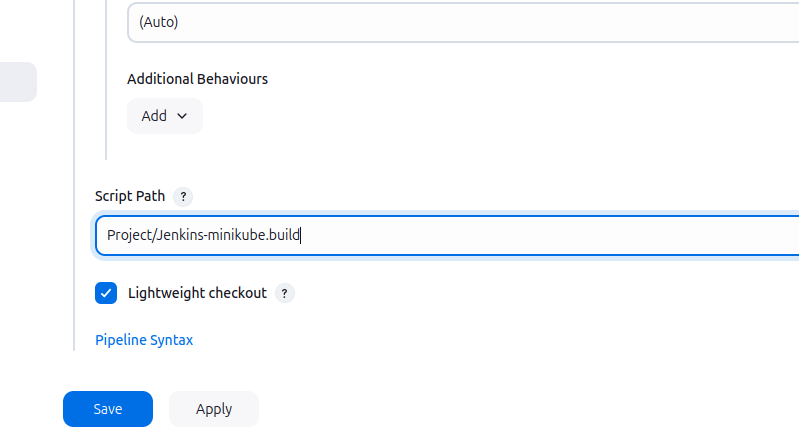

Build the pipeline from the jenkins UI (it may take some time)

### Check the deployment

```bash
kubectl get all -n prod
```

You should see all the pods, deployments, services, and replicas running

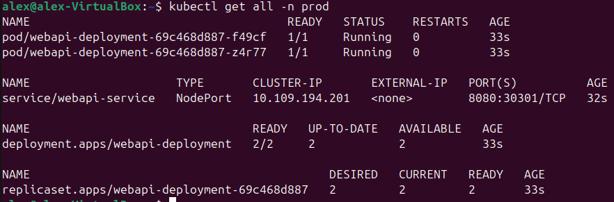

### Access the API

```bash
minikube service webapi-service -n prod
```

You will see the api running and you can check our name with the `/whoami` endpoint

## Using Buildpack to Build and Run the Application

### Install Buildpack (Pack CLI)

```bash
sudo add-apt-repository ppa:cncf-buildpacks/pack-cli
sudo apt-get update
sudo apt-get install pack-cli
pack --version
```

Go into the Project/webapi folder of the git repo if you are not already in it

Before running the command, We had to change the go version from 1.21.5 to 1.20 (in the go.mod) because buildpack is not compatible

```bash
pack build efrei2023/project-alexah-buildpack:2001 --path . --builder paketobuildpacks/builder:base
```

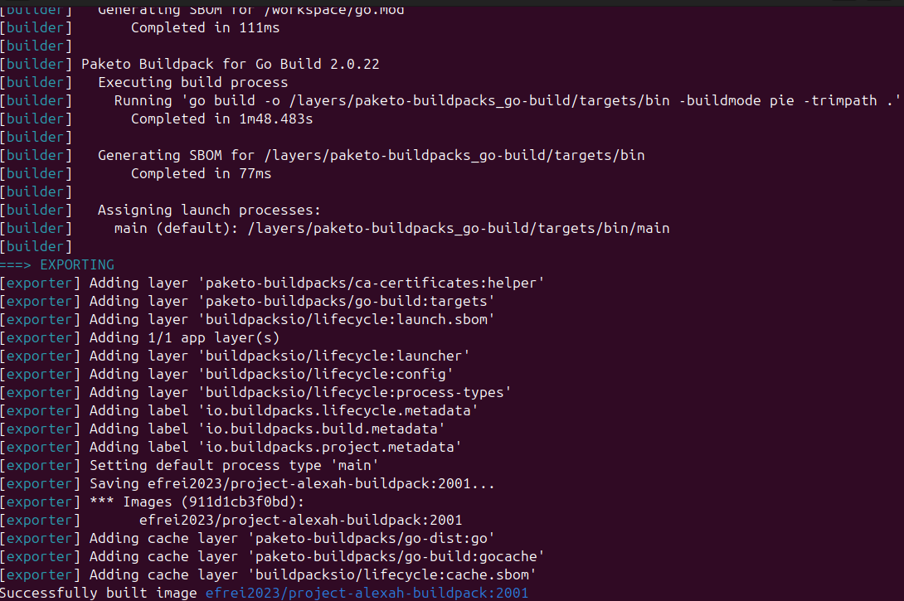

List the images to confirm the new image is created:

```bash
docker images
```

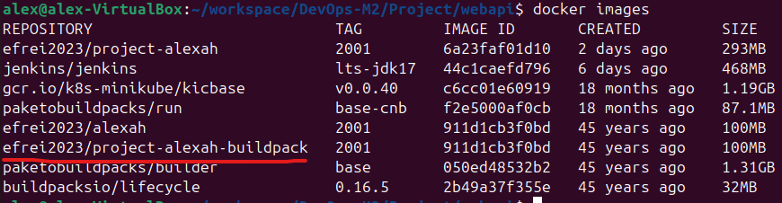

Start a container from the built image:

```bash
docker run -d -p 8082:8080 efrei2023/project-alexah-buildpack:2001
```

Check if the container is running by visiting `http://localhost:8082/whoami` in a web browser.

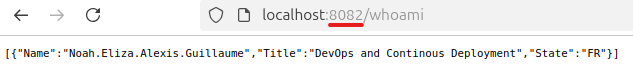

**Advantages of Buildpack**:

- Eliminates the need for a `Dockerfile`.

- Automates optimization and security configurations.

**Limitations of Buildpack**:

- Less control over the build process compared to Dockerfile.

- Relies on existing Buildpacks, We needed to change the version of go to make it work.

**Performance**:

- Buildpack-produced images are slightly smaller and faster for simple apps.

- Dockerfile provides better flexibility for larger or more complex builds.

- The buid process for build pack is a lot slower than the dockerfile (it had to install others images of buildpacks)

## Monitoring

Install Helm

```bash
sudo snap install helm --classic
```

### Prometheus and Grafana

Install Prometheus using their official Helm chart

```bash
helm repo add prometheus-community https://prometheus-community.github.io/helm-charts
helm install prometheus prometheus-community/prometheus --namespace prod
```

Run prometheus by running theses commands in the same shell (the output of the last command will give you theses commands)

```bash
export POD_NAME=$(kubectl get pods --namespace prod -l "app.kubernetes.io/name=prometheus,app.kubernetes.io/instance=prometheus" -o jsonpath="{.items[0].metadata.name}")
kubectl --namespace prod port-forward $POD_NAME 9090
```

You can now access Prometheus at `http://localhost:9090`

Install Grafana using their official Helm chart (in a different terminal to keep prometheus running)

```bash
helm repo add grafana https://grafana.github.io/helm-charts
helm install grafana grafana/grafana --namespace prod
```

Get your admin password

```bash
kubectl get secret --namespace prod grafana -o jsonpath="{.data.admin-password}" | base64 --decode ; echo
```

Run grafana by running theses commands in the same shell (the output of the last command will give you theses commands)

```bash
export POD_NAME=$(kubectl get pods --namespace prod -l "app.kubernetes.io/name=grafana,app.kubernetes.io/instance=grafana" -o jsonpath="{.items[0].metadata.name}")
kubectl --namespace prod port-forward $POD_NAME 3000
```

Connect to Grafana at `http://localhost:3000` with the username `admin` and the password you got earlier

From grafana UI, add new datasource and select Prometheus, then set the URL to `http://prometheus-server.prod.svc.cluster.local` (given by the output of the helm install command for prometheus)

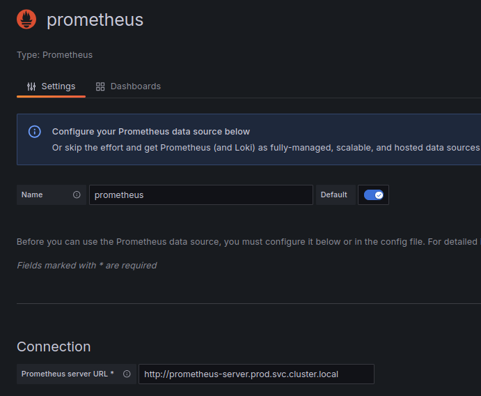

Now create a Dashboard, select 'import dashboard' and use the ID `1860` (this is the ID of the dashboard we used)

Select the Prometheus datasource you created earlier and click import

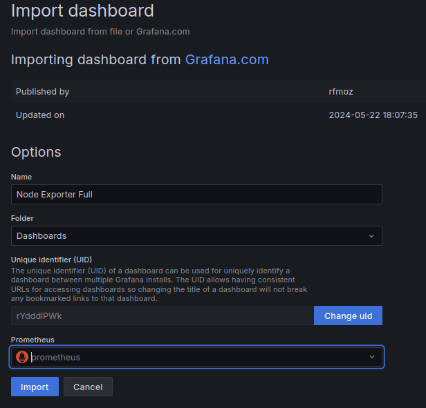

### Alert Manager

Get the alert manager URL

```bash
export POD_NAME=$(kubectl get pods --namespace prod -l "app.kubernetes.io/name=alertmanager,app.kubernetes.io/instance=prometheus" -o jsonpath="{.items[0].metadata.name}")
kubectl --namespace prod port-forward $POD_NAME 9093
```

You can now access Alert Manager at `http://localhost:9093`

Go into the Project folder of the git repo if you are not already in it (you can see the alert rules in the `alert.rules.yml` file)

Apply the alert rules

```bash
helm upgrade --reuse-values -f prometheus-alerts-rules.yml prometheus prometheus-community/prometheus --namespace prod
```

Now you can delete the prometheus-prometheus-pushgateway deployment to test the alerts

```bash
kubectl delete deployment prometheus-prometheus-pushgateway -n prod
```

After some time, you should see the alerts in the Alert Manager UI (the config file is set to send an alert if the pushgateway is down for more than 1 minute but it take sometimes a bit more probably because of the performance of the VM)

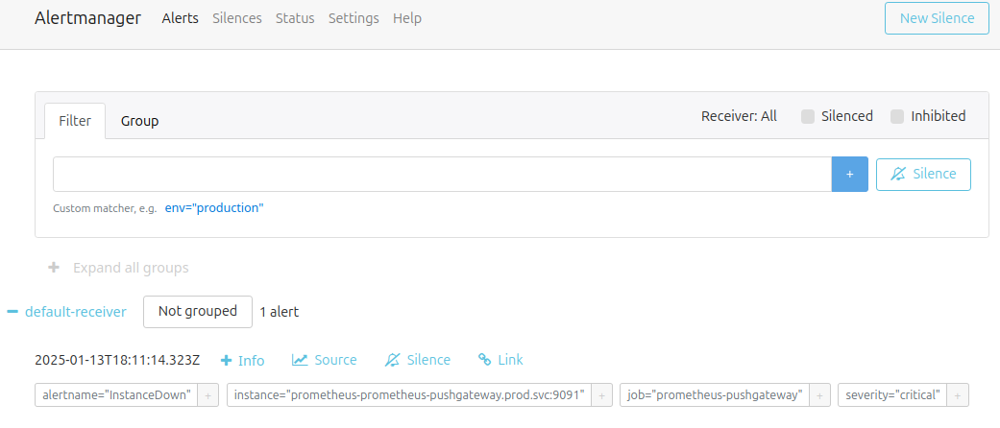

Recreate de deployment

```bash
helm upgrade prometheus prometheus-community/prometheus --namespace prod
```

Apply the email config rules

```bash
helm upgrade --reuse-values -f alertmanager-config-email.yml prometheus prometheus-community/prometheus --namespace prod
```

Delete the alertmanager deployment again and you will receive an email with the alert (at the address you set in the config file)

```bash
kubectl delete deployment prometheus-prometheus-pushgateway -n prod
```

It takes a bit of time to receive the email but you should receive it after a few minutes

I did one shot and you have receive an email on `lazhar.hamel@efrei.fr` the 13/01/2025 at 20:53 like this one with our names

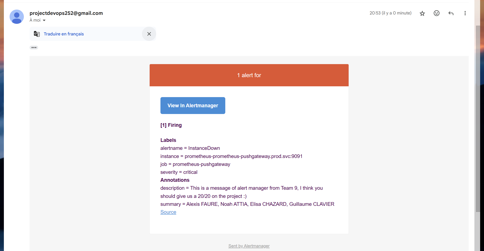

## Log Management

Go into Project folder of the git repo if you are not already in it then run the following command to install Loki

```bash
helm install loki grafana/loki -f values.yml -n prod
```

Configure Loki Data Source in Grafana with the URL `http://loki.prod.svc.cluster.local/` (given by the output of the helm install command for loki)

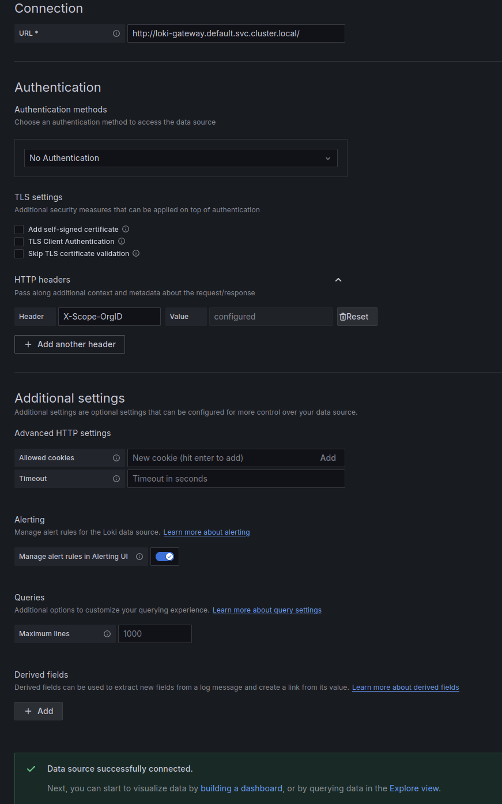

you need to install promtail to give the logs to loki

```bash
helm install promtail grafana/promtail -f promtail-values.yml -n prod
```

Verify the logs are being sent to Loki

```bash
kubectl logs -l app=promtail -n prod
```

Now you have the logs in Grafana go to explore and Loki

you can set the query like this

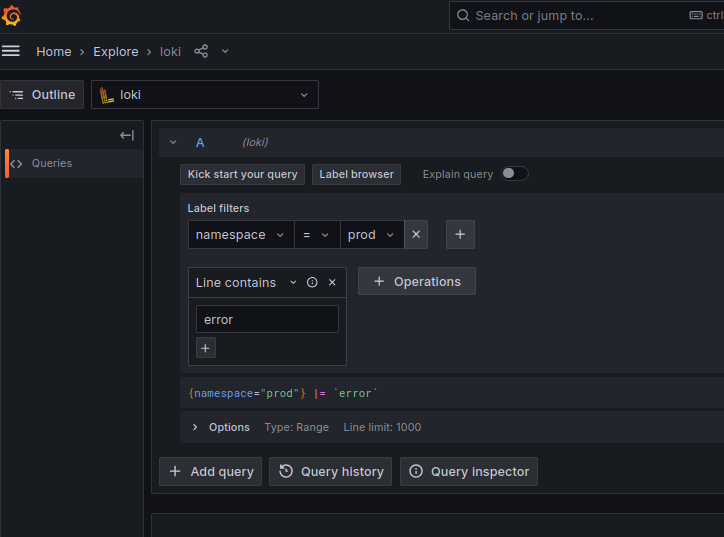
