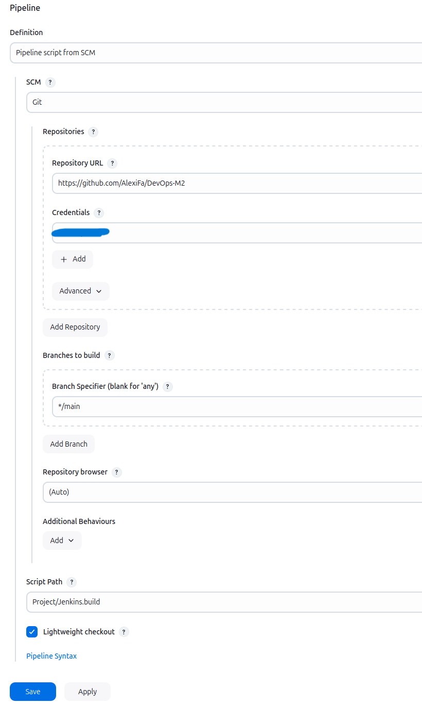

# Project

## Requirements

- Docker
- Docker Compose
- Minikube
- Kubectl
- Git
  
### Check Requirements

```bash
docker --version            # Should be Docker 24.0.7 or higher
minikube version            # Should be Minikube v1.31.2 or higher
kubectl version --client    # Should be Kubernetes CLI v1.28.3 or higher
docker-compose --version    # Should be Docker Compose v2.23.0 or higher
git --version               # Should be Git 2.41.0 or higher
```

## Setup

### Retrieve the source code repository locally on your virtual machine with the command

```bash
git clone https://github.com/AlexiFa/DevOps-M2/Project.git
```

### Launch Jenkins

```bash
sudo docker run -d -p 8080:8080 -p 50000:50000 --name jenkins --restart unless-stopped jenkins/jenkins:lts-jdk17
```

Get the admin password

```bash
sudo docker exec jenkins cat /var/jenkins_home/secrets/initialAdminPassword
```

- select `install the suggested plugins` (wait for the installation to finish and do the setup steps)

### Install Jenkins Plugins <!-- TODO : check if it is enough -->

- Go to Manage Jenkins > Plugins.

- Search and install the "Docker Pipeline" plugin.

- Click on restart Jenkins when installation is complete.

### Create Credentials <!-- TOcheck -->

Navigate to Manage Jenkins > Credentials in the Jenkins interface.

Add two sets of credentials by clicking on (Global) then Add Credentials:

<!-- Git : https://github.com/AlexiFa/DevOps-M2/Project.git

		you can put your github username and password

        ID: github-credentials -->

	Docker Hub:

		Username: efrei2023

		Password: efrei2023

        ID: dockerhub-credentials

<!-- ### Create a network for docker infrastructure:

```bash
docker network create --driver bridge efrei
``` -->

### Set Up a Jenkins Slave

#### Prepare the Slave Machine:
  - Install Java (Jenkins requires Java to run). (openjdk 17)
  - Install Docker (if builds involve Docker commands).
  <!-- - Create a dedicated user for Jenkins. -->
  
#### Connect the Slave to the Master:
  On Jenkins, go to Manage Jenkins > Nodes > New Node.
#### Add the slave machine details:
  - Name it "jenkins-slave".
  - Choose "Permanent Agent".
  - Set up the remote root directory (e.g., /home/jenkins).
    - you need to create the directory
  <!-- - Add the machine's labels for job targeting. -->
  <!-- - Copy the "agent.jar" from the Jenkins master to the slave machine. -->

#### Start the Slave:

click on the slave and copy the command line to run on your machine

eg.:
```bash
curl -sO http://localhost:8080/jnlpJars/agent.jar
sudo java -jar agent.jar -url http://127.0.0.1:8080/computer/ -secret <SECRET_KEY privided> -name "jenkins-slave" -webSocket -workDir "/home/jenkins"
```

#### Verify Connection:

The slave should now appear as "online" in the Jenkins "Nodes" section.

### Create Jenkins Pipeline <!-- TODO : add arrows to the screenshots -->




then, you can build the pipeline from the jenkins dashboard and at the end you will see the container running

```bash
sudo docker ps
```

And you will see the API running at `http://localhost:8081`

`http://localhost:8081/whoami` will return our names
