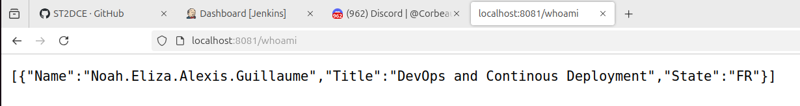

# Project

## Requirements

- Docker
- Docker Compose
- Minikube
- Kubectl
- Git
  
### Check Requirements

```bash
docker --version            # Should be Docker 24.0.7 or higher
minikube version            # Should be Minikube v1.31.2 or higher
kubectl version --client    # Should be Kubernetes CLI v1.28.3 or higher
docker-compose --version    # Should be Docker Compose v2.23.0 or higher
git --version               # Should be Git 2.41.0 or higher
```

## Setup

### Instal buildpacks

```bash
sudo add-apt-repository ppa:cncf-buildpacks/pack-cli
sudo apt-get update
sudo apt-get install pack-cli
```
<!-- 
Install go libraries

```bash
sudo apt install golang-go
go get -u github.com/cncf/buildpack/pack
``` -->

### Retrieve the source code repository locally on your virtual machine with the command

```bash
git clone https://github.com/AlexiFa/DevOps-M2/Project.git
```

### Set docker to be used without sudo

```bash
sudo usermod -aG docker $USER && newgrp docker
```

### Launch Jenkins

```bash
sudo docker run -d -p 8081:8080 -p 50000:50000 --name jenkins -v /var/run/docker.sock:/var/run/docker.sock --restart unless-stopped jenkins/jenkins:lts-jdk17
```

Get the admin password

```bash
sudo docker exec jenkins cat /var/jenkins_home/secrets/initialAdminPassword
```

- select `install the suggested plugins` (wait for the installation to finish and do the setup steps)

### Create Credentials <!-- TOcheck -->

Navigate to Manage Jenkins > Credentials in the Jenkins interface.

Add two sets of credentials by clicking on (Global) then Add Credentials:

```text
Docker Hub:

- Username: efrei2023

- Password: efrei2023

- ID: dockerhub-credentials
```

### Set Up a Jenkins Slave

#### Prepare the Slave Machine

- Install Java (Jenkins requires Java to run). (openjdk 17)

- Install Docker (if builds involve Docker commands).
  
#### Connect the Slave to the Master

On Jenkins, go to Manage Jenkins > Nodes > New Node.

#### Add the slave machine details

- Name it "jenkins-slave".

- Choose "Permanent Agent".

- Set up the remote root directory (take a dir where you have right eg: /home/alex/workspace/agent).
  - you need to create the directory

#### Start the Slave

click on the slave and copy the command line to run on your machine

eg.:

```bash
curl -sO http://localhost:8081/jnlpJars/agent.jar
sudo java -jar agent.jar -url http://127.0.0.1:8081/computer/ -secret <SECRET_KEY privided> -name "jenkins-slave" -webSocket -workDir "/home/alex/worksapce/agent"
```

#### Verify Connection

The slave should now appear as "online" in the Jenkins "Nodes" section.

### Create Jenkins Pipeline <!-- TODO : add arrows to the screenshots -->


then, you can build the pipeline from the jenkins dashboard and at the end you will see the container running

`note`: you may need to enter the sudo password in the command line where the agent.jar is running

```bash
sudo docker ps
```

And you will see the API running at `http://localhost:8080`

`http://localhost:8080/whoami` will return our names



## Kubernetes deployemnt

### Start minikube

Start minikube with the following command

```bash
minikube start --driver=docker
```

### create a new item pipeline on Jenkins

This time, select the Jenkins-minikube.build file


Build the pipeline from the jenkins UI (it may take some time)

### Check the deployment

```bash
kubectl get all -n prod
```

You should see all the pods, deployments, services, and replicas running


### Access the API

```bash
minikube service webapi-service -n prod
```

You will see the api running and you can check our name with the `/whoami` endpoint

### Build with buildpacks

Buildpack is easer to use than a dockerfile because developers don't need to know how to write a dockerfile, it detects the language and the dependencies and build the image for you

But it's a lot slower than a dockerfile
